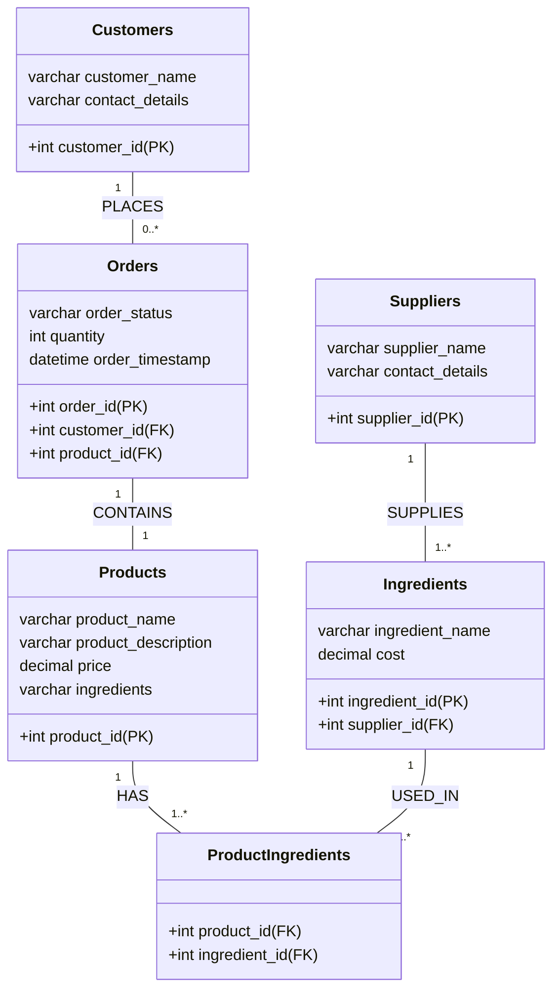
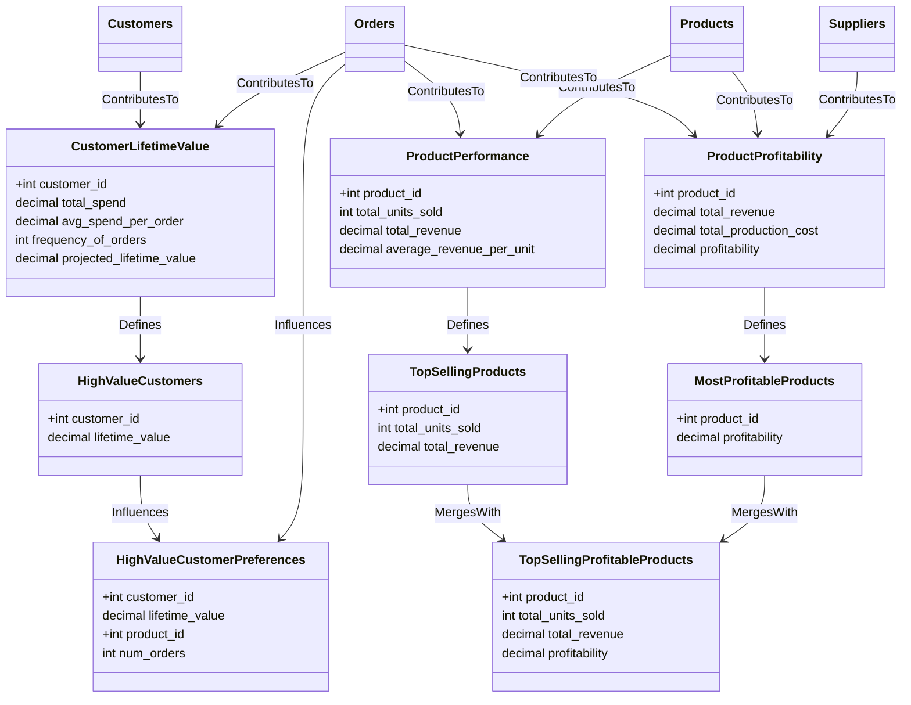

## StarBake

**StarBake** is a fictional & demonstrative project designed to showcase the usage of Starlake for data transformation and analytics in an e-commerce bakery business setting. The project begins by collecting raw operational data from various domains, including digital transactions, customer interactions, inventory management, and supplier relationships.

This data is organized into six primary tables: Customers, Orders, Products, Suppliers, Ingredients, and ProductIngredients. Each table contains relevant data fields that are updated daily, with data arriving in JSON, JsonND, or CSV format.

The core of the StarBake project lies in its transformation of the ingested raw data. The data is converted into meaningful business insights by creating a series of analytical-ready tables: CustomerLifetimeValue, ProductPerformance, ProductProfitability, HighValueCustomers, TopSellingProducts, and MostProfitableProducts. Further tables (TopSellingProfitableProducts and HighValueCustomerPreferences) are created by joining multiple transformed tables to deliver more nuanced business insights.

The final goal of StarBake is to provide users a practical understanding of how Starlake can be harnessed for data ingestion, transformation, and analytics. The project focuses on Google BigQuery as the data warehousing solution. Through this project, users will get hands-on experience in gleaning a wide range of business insights, including customer lifetime value, product performance, product profitability, and customer preferences.

### Tables to Ingest:

1. **Customers:** This table houses customer-specific details. It includes fields such as `customer_id` (Primary Key), `customer_name`, and `contact_details`. The data for this table arrives in JSON format, updated daily with deltas.

2. **Orders:** This table contains order-specific information. Fields include `order_id` (Primary Key), `customer_id` (Foreign Key linking to Customers), `product_id` (Foreign Key linking to Products), `order_status`, `quantity`, and `order_timestamp`. The data for this table arrives in JsonND format, updated daily with deltas.

3. **Products:** This table stores records about the bakery items sold. It includes fields such as `product_id` (Primary Key), `product_name`, `product_description`, and `price`. The data for this table arrives in JsonND format, updated daily with deltas.

4. **Suppliers:** This table carries details about suppliers. It includes fields such as `supplier_id` (Primary Key), `supplier_name`, and `contact_details`. The data for this table arrives in CSV format, with full updates daily.

5. **Ingredients:** This new table includes `ingredient_id` as a primary key, `ingredient_name`, the `cost` of each ingredient, and `supplier_id` as a foreign key linking to the Suppliers table. The data for this table arrives in CSV format, with full updates daily.

6. **ProductIngredients:** This table maps `Products` to `Ingredients`, crucial for calculating the total cost of ingredients for each product. It contains `product_id` and `ingredient_id` as foreign keys linking to the respective tables. The data for this table arrives in CSV format, with full updates daily.

### Business Insights transformations:

1. **CustomerLifetimeValue:** This table gives a projection of the total value a customer may bring to the bakery over the entirety of their relationship. This could be calculated using data from the `Orders` table, such as total spend to date, average spend per order, and frequency of orders.

2. **ProductPerformance:** This table provides details on the performance of each product sold at the bakery, including the total number of units sold, total revenue generated, and average revenue per unit sold. It's derived from the `Orders` and `Products` tables.

3. **ProductProfitability:** This table offers insights into the profitability of each product. It considers the cost of production (based on the `Suppliers` table and the cost of ingredients), as well as the revenue generated (based on the `Orders` table).

4. **HighValueCustomers:** This table identifies customers with the highest lifetime value, making it easier to target these customers for marketing campaigns. It's derived from the `CustomerLifetimeValue` table.

5. **TopSellingProducts:** This table identifies the products that perform the best in terms of units sold and revenue. It's derived from the `ProductPerformance` table.

6. **MostProfitableProducts:** This table identifies the most profitable products, allowing the bakery to focus on promoting these products to maximize profits. It's derived from the `ProductProfitability` table.

Additional tables that join multiple transformed tables:

7. **TopSellingProfitableProducts:** This table combines the `TopSellingProducts` and `MostProfitableProducts` tables to highlight the products that are not only top sellers but also bring in high profit margins.

8. **HighValueCustomerPreferences:** This table combines the `HighValueCustomers` and `CustomerProductAffinity` tables to determine the product preferences of high-value customers.

The project aims to give users a practical understanding of Starlake's functionalities, allowing them to leverage these features for their data transformation and analytics requirements.

## To-Do List

#### Data Ingestion
- [ ] Set up data ingestion mechanisms for each of the primary tables.
    - [ ] Configure JSON data ingestion for the `Customers` table.
    - [ ] Configure JsonND data ingestion for the `Orders` and `Products` tables.
    - [ ] Configure CSV data ingestion for the `Suppliers`, `Ingredients`, and `ProductIngredients` tables.

#### Data Transformation
- [ ] Define transformations for creating analytical tables.
    - [ ] Design transformations for `CustomerLifetimeValue` using data from `Orders`.
    - [ ] Design transformations for `ProductPerformance` using data from `Orders` and `Products`.
    - [ ] Design transformations for `ProductProfitability` using data from `Orders`, `Suppliers`, and `Products`.
    - [ ] Design transformations for `HighValueCustomers` using data from `CustomerLifetimeValue`.
    - [ ] Design transformations for `TopSellingProducts` using data from `ProductPerformance`.
    - [ ] Design transformations for `MostProfitableProducts` using data from `ProductProfitability`.

#### Data Combination
- [ ] Combine multiple transformed tables to create new analytical tables.
    - [ ] Create `TopSellingProfitableProducts` table by merging `TopSellingProducts` and `MostProfitableProducts`.
    - [ ] Create `HighValueCustomerPreferences` table by merging `HighValueCustomers` and `Orders`.

#### Workflow
- [ ] Add .vscode project configuration that include the necessary plugins.
- [ ] Add sqlfluff as sql formatter
- [ ] Add pre-hook to compile & format the code before commit
