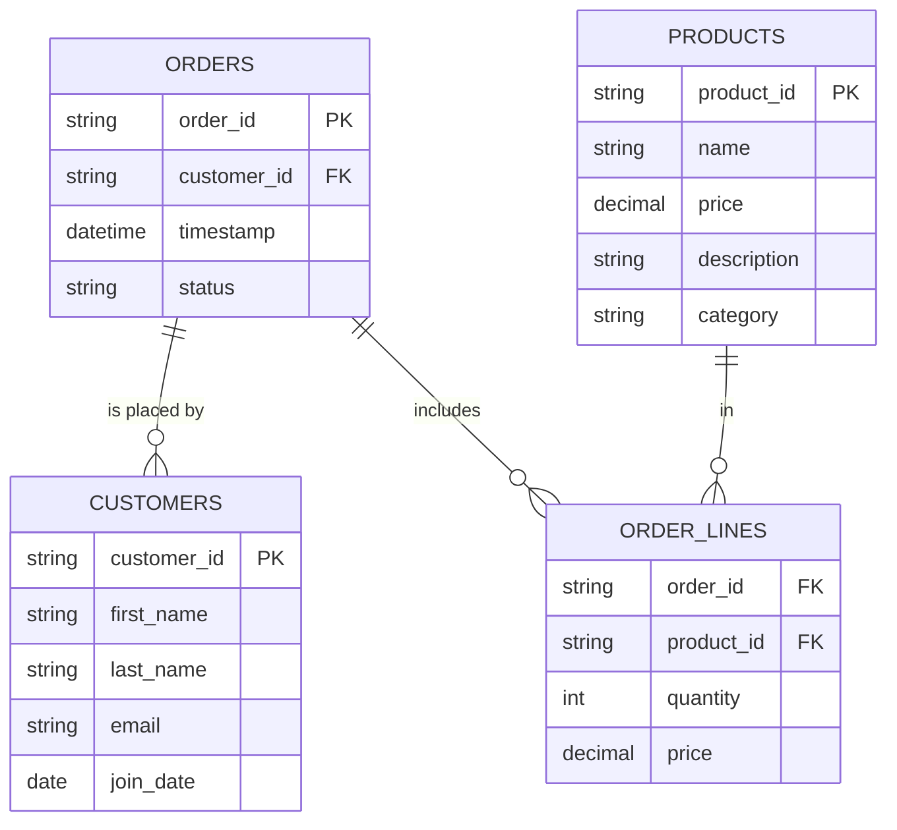
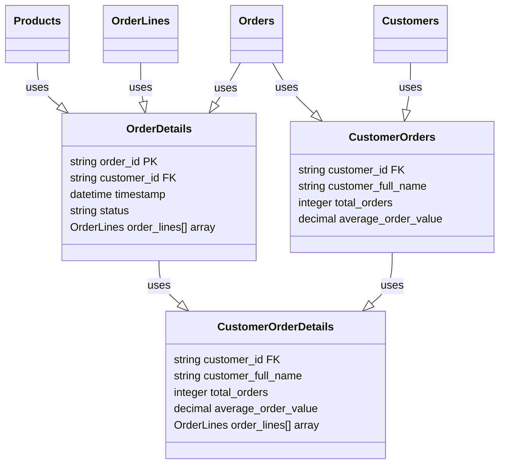

## StarBake

**StarBake** is a fictional & demonstrative project designed to showcase the usage of Starlake for data transformation and analytics in an e-commerce bakery business setting. The project begins by collecting raw operational data from various sources, such as digital transactions, inventory management.

This data is organized into five primary tables: Customers, Orders, OrderLines, Products, and Suppliers. Each table contains relevant data fields that are updated daily. Data arrives in [JSON](https://en.wikipedia.org/wiki/JSON#Syntax), [NDJSON](https://en.wikipedia.org/wiki/JSON_streaming#Newline-delimited_JSON), or [CSV](https://en.wikipedia.org/wiki/Comma-separated_values) format.

The core of the StarBake project lies in its transformation of the ingested raw data. The data is converted into meaningful business insights by creating a series of analytical-ready tables: CustomerLifetimeValue, ProductPerformance, ProductProfitability, HighValueCustomers, TopSellingProducts, and MostProfitableProducts. Further tables (TopSellingProfitableProducts and HighValueCustomerPreferences) are created by joining multiple transformed tables to deliver more nuanced business insights.

The final goal of StarBake is to provide users a practical understanding of how Starlake can be harnessed for data ingestion, transformation, and analytics. The project focuses on Google BigQuery as the data warehousing solution. Through this project, users will get hands-on experience in gleaning a wide range of business insights, including customer lifetime value, product performance, product profitability, and customer preferences.

### Tables to Ingest:

Here's a breakdown of the tables with column descriptions:

1. **customers:** This table contains information about the bakery's customers. The data for this table arrives in CSV format, updated daily with deltas.
    - `customer_id`: A unique identifier for each customer.
    - `first_name`: The customer's first name.
    - `last_name`: The customer's last name.
    - `email`: The customer's email address.
    - `join_date`: The date when the customer joined.

2. **orders:** This table contains information about the bakery's orders. The data for this table arrives in JSON format, updated daily with deltas.
    - `order_id`: A unique identifier for each order.
    - `customer_id`: An identifier for the customer who placed the order, referencing `Customers.customer_id`.
    - `timestamp`: The date and time when the order was placed.
    - `status`: The status of the order, like 'placed', 'shipped', or 'delivered'.

3. **order_lines:** This table contains information about the individual items within each order. The data for this table arrives in CSV format, updated daily with deltas.
    - `order_id`: An identifier for the order, referencing `Orders.order_id`.
    - `product_id`: An identifier for the product, referencing `Products.product_id`.
    - `quantity`: The quantity of this product in the order.
    - `price`: The price of the product at the time of ordering.

4. **products:** This table contains information about the bakery's products. The data for this table arrives in JSON_ND format, updated daily with deltas.
    - `product_id`: A unique identifier for each product.
    - `name`: The product's name.
    - `price`: The current price of the product.
    - `description`: A detailed description of the product.
    - `category`: The category of the product, like 'bread', 'cake', or 'pastry'.

**### Business Insights transformations:

### Business Insights Transformations:

1. **CustomerOrders:** A table derived from the `Customers` and `Orders` tables, displaying the customer ID, customer's full name, total number of orders made by each customer, and the average order value.

2. **OrderDetails:** A table formed from the `Orders`, `OrderLines`, and `Products` tables. The OrderDetails table includes all the essential details of an order made from a particular customer, including order ID, customer ID, the timestamp of the order, order status, and an array of order line items.

3. **CustomerOrderDetails:** An extension of the `OrderDetails` and `CustomerOrders` tables, this new table provides a comprehensive view into the behavior of each customer, containing information about order details along with the customer's full name, total number of orders, and the average order value.

The project aims to give users a practical understanding of Starlake's functionalities, allowing them to leverage these features for their data transformation and analytics requirements.

## How to run
Please check [HOW_TO_RUN.md](HOW_TO_RUN.md)

#### Workflow
- [ ] Add .vscode project configuration that include the necessary plugins.
- [ ] Add sqlfluff as sql formatter
- [ ] Add pre-hook to compile & format the code before commit
