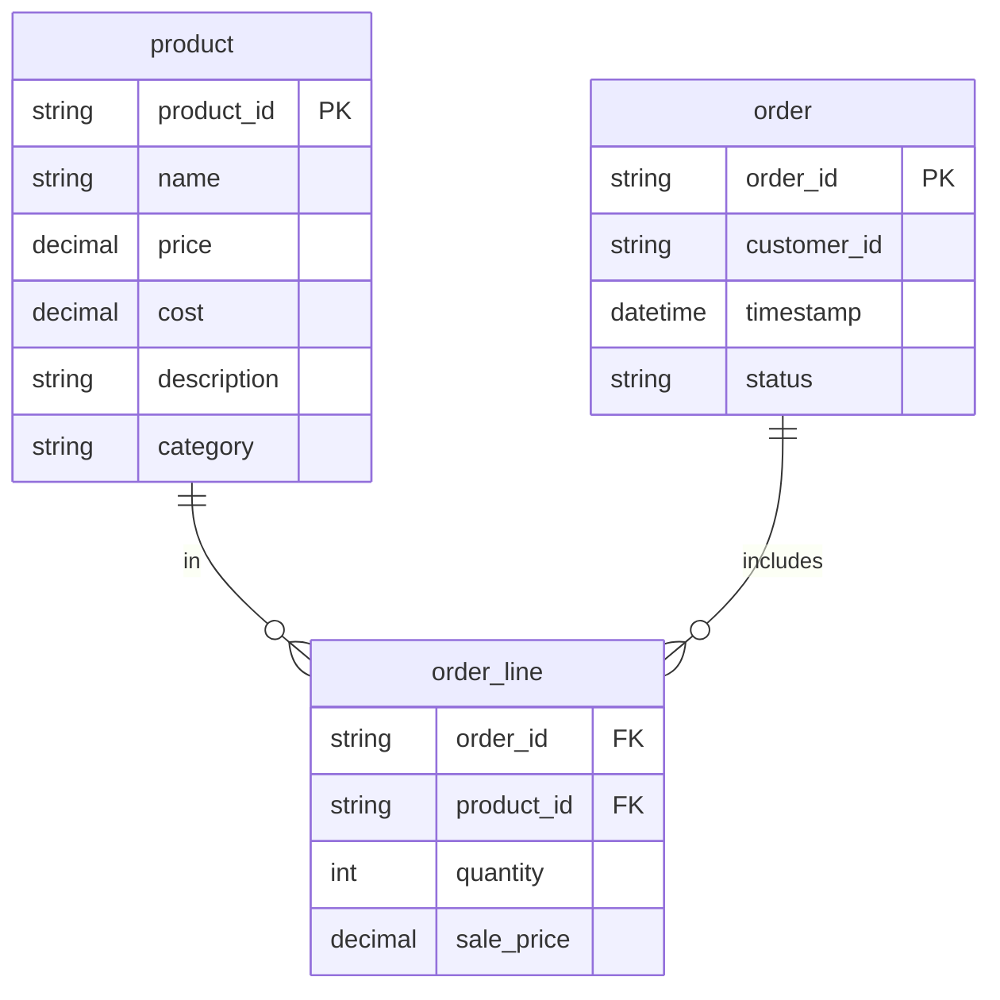
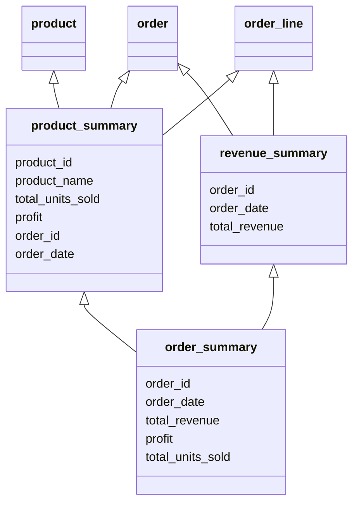

## StarBake

Welcome to the StarBake project tutorial! This guide will walk you through the end-to-end process of using Starlake to transform raw operational data into insightful business analytics.

StarBake aims to offer hands-on experience with Starlake, using Google BigQuery as the primary data warehousing solution. This tutorial covers essential aspects of the data transformation process, including 
- extracting data from various sources,
- raw data ingestion
- transformation into business insights
- orchestrating the ingestion and transformation process.

### 1. Data Structure To Extract

StarBake project focuses mainly on four tables: Customers, Orders, OrderLines, and Products. Each table contains daily updated operational data from the e-commerce bakery business. The databases use specific identifiers (order_id, product_id) to form relationships.

1**order:** This table contains information about the bakery's orders. The data for this table arrives in JSON format, updated daily with deltas.
    - `order_id`: A unique identifier for each order.
    - `timestamp`: The date and time when the order was placed.
    - `status`: The status of the order, like 'placed', 'shipped', or 'delivered'.

3. **order_lines:** This table contains information about the individual items within each order. The data for this table arrives in CSV format, updated daily with deltas.
    - `order_id`: An identifier for the order, referencing `Orders.order_id`.
    - `product_id`: An identifier for the product, referencing `Products.product_id`.
    - `quantity`: The quantity of this product in the order.
    - `price`: The price of the product at the time of ordering.

4. **product:** This table contains information about the bakery's products. The data for this table arrives in JSON_ND format, updated daily with deltas.
    - `product_id`: A unique identifier for each product.
    - `name`: The product's name.
    - `price`: The current price of the product.
    - `cost`: The cost of the product.
    - `description`: A detailed description of the product.
    - `category`: The category of the product, like 'bread', 'cake', or 'pastry'.

### 2. Data Ingestion

### 3. Business Insights Transformations:

1. **product_summary**: This table highlighting each product's performance. It connects to the Product and Order tables, providing data on unit sales and profits for each product.
2. **order_summary**: This table offers condensed data on the starbake's revenue from each sale. It pulls data from order and order_line tables, delivering insights on income sources and financial status.
3. **revenue_summary**: This table aggregates business data for each order, taking details from revenue_summary and product_summary. This gives a complete view of each order's impact.

### 4. Orchestration

## How to run
Please check [HOW_TO_RUN.md](HOW_TO_RUN.md)

#### Workflow
- [ ] Add .vscode project configuration that include the necessary plugins.
- [ ] Add sqlfluff as sql formatter
- [ ] Add pre-hook to compile & format the code before commit
